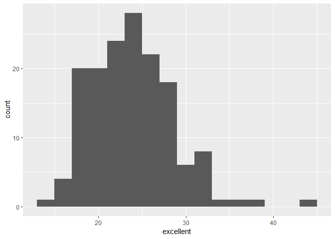

HW2\_Markdown
================
Noah Kreski

Problem One
===========

``` r
#I am reading in the data file.
subway_data = read.csv("./data/NYC_Transit_Subway_Entrance_And_Exit_Data.csv")%>%
              #This is to ensure workable names.
              janitor::clean_names(dat = .)%>%
              #I am selecting only the variables I need
              select(.data = ., line:entry, vending, ada)
              #I am using the car package recode function (for convenience) to recode the names of yes and no in the entry column.
              subway_data$entry <- car::recode(subway_data$entry,"'YES' = TRUE;'NO'=FALSE")
              #Now that the names are correct, I can convert to logical
              subway_data$entry <- as.logical(subway_data$entry)
```

These data describe pertinent characteristics of the NYC subway system. These include the location and name of various stations, the routes served, accessibility characteristics, and more. Cleaning these data involved an import, using janitor to clean the names, selecting only the variables needed, and using the convert function to produce a logical vector. The dimensions of the data set are as follows: 1868 rows by 19 columns using the nrow and ncol functions. These data are not entirely tidy, as certain variables, like route number/letter, are split up and thus many cells are empty.

### How many distinct subway stations are there?

``` r
#This will tell me how many distinct line/name combos there are.
distinct(subway_data, line, station_name)
```

There are 465 distinct station names with a unique combination of station name and line.

### How many are ADA compliant?

``` r
#I am getting the data set of distinct subway stations and keeping those that are ada-compliant
filter(distinct(subway_data,line,station_name,.keep_all = TRUE), ada == TRUE)%>%
  nrow()
```

There are 84 stations that are ADA compliant.

### What proportion of station entrances / exits without vending allow entrance?

``` r
#This mean value is the proportion of responses where entry is TRUE among the data entries where vending = "NO"
mean(filter(subway_data, vending =="NO")$entry)
```

The proportion of subway entrances/exits without vending that allow entrance is .3770492 based on the above code.

### Reformat data so that route number and route name are distinct variables. How many distinct stations serve the A train? Of the stations that serve the A train, how many are ADA compliant?

``` r
#I am using a gather statement to make the route number and name separate variables, then getting the distinct combinations of line, station, and route name.
subway_data_tidier = distinct(gather(subway_data, key = route_number, value = route_name, route1:route11), line, station_name,  route_name, .keep_all = TRUE)

#This will tell me how many station/line combos serve the A train
filter(subway_data_tidier, route_name == "A")%>%
  nrow()
#This will tell me how many station/line combos serve the A train and are ada-compliant
filter(subway_data_tidier, route_name == "A" & ada == TRUE)%>%
  nrow()
```

Using the above code, there are 60 stations that serve the A train, and 17 of those are ADA compliant.

Problem Two
===========

Problem Three
=============

``` r
#I am formatting appropriate names
brfss_smart2010_Tidy = janitor::clean_names(brfss_smart2010)%>%
                      #I am removing unneeded variables
                      select(-class, -topic, -question, -sample_size, -(confidence_limit_low:geo_location))%>%
                      #I am isolating necessary data values
                      filter(response %in% c("Excellent", "Very good", "Good", "Fair", "Poor"))%>%
                      #I am splitting by response category and creating a new variable
                      spread(key=response, value = data_value)%>%
                      janitor::clean_names()%>%
                      mutate(EVG = excellent + very_good)
#Making this separate as opposed to part of a longer pipeline feels appropriate given that it will be used multiple times.
brfss_smart2010_Tidy_2002 = filter(brfss_smart2010_Tidy, year == 2002)
```

### How many unique locations are included in the dataset?

There are 404 locations, based on the distinct number of location descriptions. (Code in-text)

### Is every state represented?

Every state is represented given that there are 51 location abbreviations which account for all states and Washington D.C. (Code in-text)

### What state is observed the most?

``` r
#This will show me the number of observations per state.
table(brfss_smart2010_Tidy$locationabbr)
```

    ## 
    ##  AK  AL  AR  AZ  CA  CO  CT  DC  DE  FL  GA  HI  IA  ID  IL  IN  KS  KY 
    ##  11  18  21  32  52  59  47   9  27 122  27  31  14  32  25  21  38   9 
    ##  LA  MA  MD  ME  MI  MN  MO  MS  MT  NC  ND  NE  NH  NJ  NM  NV  NY  OH 
    ##  45  79  90  31  34  33  25  23  18 115  18  53  48 146  43  18  65  59 
    ##  OK  OR  PA  RI  SC  SD  TN  TX  UT  VA  VT  WA  WI  WV  WY 
    ##  40  33  59  38  63  18  26  71  50   4  48  97   9   9  22

Using the table function, which listed the number of observations for each location abbreviation, the 50 states and Washington DC, it can be seen that New Jersey, with 146 observations, is the most observed.

### In 2002, what is the median of the “Excellent” response value?

The median of the Excellent response value in 2002 is 23.6 using the median function. (Code in-text)

### Make a histogram of “Excellent” response values in the year 2002.

``` r
#Using the class example syntax, this is a histogram of the 2002 data.
ggplot(brfss_smart2010_Tidy_2002, aes(x = excellent)) + 
  geom_histogram(position = "dodge", binwidth = 2)
```



### Make a scatterplot showing the proportion of “Excellent” response values in New York County and Queens County (both in NY State) in each year from 2002 to 2010.

``` r
#This isolates the NY county data needed.
brfss_smart2010_Tidy_NY = filter(brfss_smart2010_Tidy, locationdesc %in% c("NY - New York County","NY - Queens County"))
```

``` r
#Using the class example syntax, this is a scatterplot of the NY data.
ggplot(brfss_smart2010_Tidy_NY, aes(x = year, y = excellent)) + 
  geom_point(aes(color = locationdesc))
```


